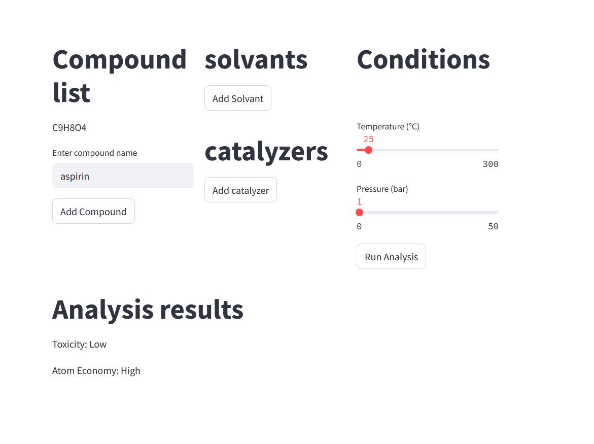

# practical programingf assignment

This is our project demo using pubchem
to analyze green chemistry reactions.

## how to run

```bash
pip install streamlit
streamlit run main.py
```

## how to use



enter your compounds, solvants, catalyzers   
set the temperature and pressure 
then click on run analysis

## additional info

in `/test/request.http`, you'll find some sample requests we have used for testing.  

# documentation
- [pub chem cookbook](https://iupac.github.io/WFChemCookbook/datasources/pubchem_pugrest1.html)
- [pub chem rest api](https://pubchem.ncbi.nlm.nih.gov/docs/pug-rest)
- [streamlit](https://docs.streamlit.io/en/stable/)